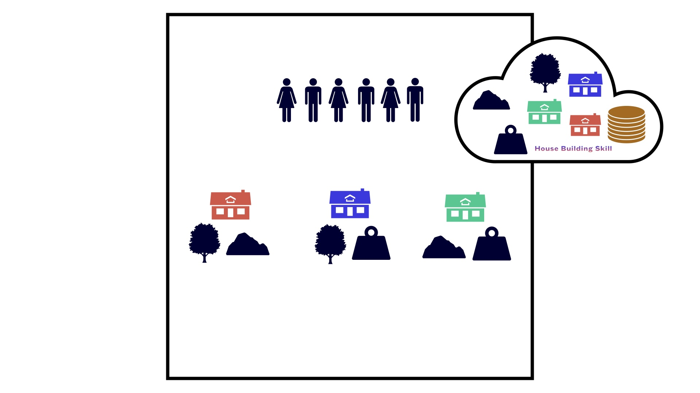

## The extended Concordia which will be compared with the extended AI-Economist, a multi-agent reinforcement learning environment (MARL)
## Incentives to Build Houses, Trade Houses, or Trade House Building Skills in Simulated Worlds under Various Governing Systems or Institutions: Comparing Multi-agent Reinforcement Learning to Generative Agent-based Model

- [The Paper](https://drive.google.com/file/d/18rxxQiXvXzZAZKzRz39sD77t2u6YnCcW/view?usp=drive_link)
- [The Results](https://github.com/aslansd/modified-concordia-marl/blob/main/examples/governing_systems/Results.zip)
- [The Notebook for the Full-Libertarian Governing System](https://github.com/aslansd/modified-concordia-marl/blob/main/examples/governing_systems/comparing_multi-agent_reinforcement_learning_to_generative_agent-based_model_FullLibertarian.ipynb.zip)
- [The Notebook for the Semi-Libertarian/Utilitarian Governing System](https://github.com/aslansd/modified-concordia-marl/blob/main/examples/governing_systems/comparing_multi-agent_reinforcement_learning_to_generative_agent-based_model_SemiLibertarianUtilitarian.ipynb.zip)
- [The Notebook for the Full-Utilitarian Governing System](https://github.com/aslansd/modified-concordia-marl/blob/main/examples/governing_systems/comparing_multi-agent_reinforcement_learning_to_generative_agent-based_model_FullUtilitarian.ipynb.zip)
- [The Notebook for Generating the Plots of the Paper](https://github.com/aslansd/modified-concordia-marl/blob/main/examples/governing_systems/comparing_multi-agent_reinforcement_learning_to_generative_agent-based_model_Plotting.ipynb)

### Abstract

It has been shown that social institutions impact human motivations to produce different behaviours. Governing system as one major social institution is able to incentivise people in a society to work more or less, specialise labor in one specific field, or diversify their types of earnings. Until recently, this type of investigation is normally performed via economists by building mathematical models or performing experiments in the field. However, with advancement in artificial intelligence (AI), now it is possible to perform in-silico simulations to test various hypotheses around this topic. Here, in a curiosity-driven project, I simulate two somewhat similar worlds using multi-agent reinforcement learning (MARL) framework of the AI-Economist and generative agent-based model (GABM) framework of the Concordia. The AI-Economist is a two-level MARL framework originally devised for simulating tax behaviours of agents in a society governed by a central planner. Here, I extend the AI-Economist so the agents beside being able to build houses using material resources of the environment, would be able to trade their built houses, or trade their house building skill. Moreover, I equip the agents and the central planner with a voting mechanism so they would be able to rank different material resources in the environment. As a result of these changes, I am able to generate two sets of governmental types. Along the individualistic-collectivists axis, I produce a set of three governing systems: Full-Libertarian, Semi-Libertarian/Utilitarian, and Full-Utilitarian. Additionally, I further divide the Semi-Libertarian/Utilitarian governing system along the discriminative axis to a set of three governing institutions: Inclusive, Arbitrary, and Extractive. Building on these, I am able to show that among three governing systems, under the Semi-Libertarian/Utilitarian one (closely resembling the current democratic governments in the world in which the agents vote and the government counts the votes of the agents and implements them accordingly), the ratios of building houses to trading houses and trading house building skill are higher than the rest. Similarly, among governing institutions of the Semi-Libertarian/Utilitarian governing system, under the Inclusive institution, the ratios of building houses to trading houses and trading house building skill are higher than the rest. Moreover, the GABM framework of Concordia is originally devised to facilitate construction and use of generative agent-based models to simulate interactions of agents in grounded social space. The agents of this framework perform actions using natural language of large language models (LLMs), and a special agent called game master (which its role is similar to the central planner in the AI-Economist) translates their actions into appropriate implementations. I extended this framework via a component considering the inventory, skill, build, vote, and tax of the agents simultaneously, to generate similar three governing systems as above: Full-Libertarian, Semi-Libertarian/Utilitarian, and Full-Utilitarian. Among these governing systems, when the game master cares about equality in the society, it seems that under the Full-Utilitarian one, the agents build more houses and trade more house building skill. In contrast, when the game master cares about productivity in the society, under the Full-Libertarian governing system, it seems that the agents simultaneously build more houses, trade more houses, and trade more house building skill. Overall, the focus of this paper is on exploratory modelling and comparison of the power of two advanced techniques of AI, MARL and GABM, to simulate a similar social phenomena with limitations. Thus its main findings need further evaluation to be strengthen.

<p align="center">
  
</p>

## Installation

### `pip` install

[Concordia is available on PyPI](https://pypi.python.org/pypi/gdm-concordia)
and can be installed using:

```shell
pip install gdm-concordia
```

### Manual install

If you want to work on the Concordia source code, you can perform an editable
installation as follows:

1.  Clone Concordia:

    ```shell
    git clone -b main https://github.com/google-deepmind/concordia
    cd concordia
    ```

2.  Install Concordia:

    ```shell
    pip install --editable .[dev]
    ```

3.  (Optional) Test the installation:

    ```shell
    pytest --pyargs concordia
    ```